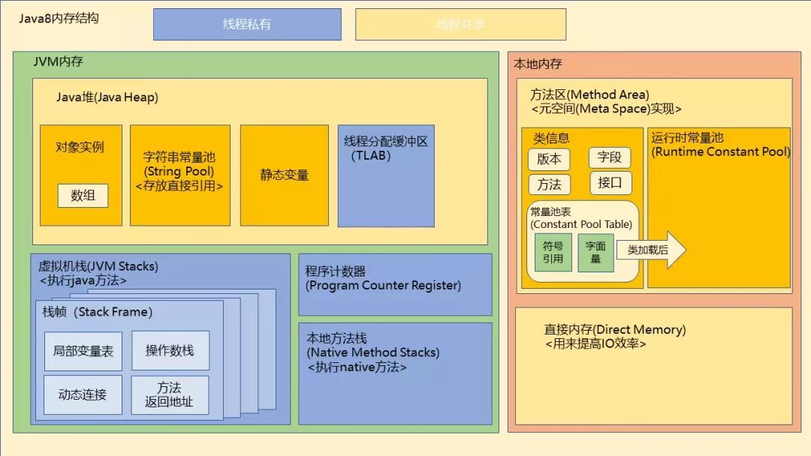

# Java技术


## Java虚拟机

 


# Java面试常问


## 死锁是什么？它是怎么产生的？如何避免？

死锁就是有两个或者多个进程由于竞争资源而造成阻塞的现象，如果无外力作用，这种局面就会一直持续下去。

#### 死锁产生的四大条件

**1、互斥条件：**指在一段时间内某资源只能由一个进程占用。（只有一副钥匙）

**2、请求和保持条件**：指进程已经保持至少一个资源，但又提出了新的资源请求，且对自己已获得的其它资源保持不放。（拿着红钥匙的人在没有归还红钥匙的情况下，又索要蓝钥匙）

**3、不剥夺条件：**指进程已获得的资源，在未使用完之前，不能被剥夺，只能在使用完时由自己释放。（只要人不主动归还钥匙，就可以一直占着钥匙）

**4、环路等待条件：**指在发生死锁时，必然存在一个进程——资源的环形链。即进程集合{P0，P1，P2，···，Pn}中的P0正在等待一个P1占用的资源；P1正在等待P2占用的资源，……，Pn正在等待已被P0占用的资源。（拿着红钥匙的人在等待蓝钥匙，而拿着蓝钥匙的人又在等待红钥匙）

#### 如何避免死锁？

要避免死锁只要破坏以上四个条件中的任意一个即可。

方法一：破坏互斥条件，在两个线程跑之前，能给每个线程单独拷贝一份钥匙的副本，就能有效的避免死锁了。如果系统拷贝那副钥匙的成本极高，而线程又很多的话，这种方法就不适用

方法二：破坏请求和保持条件

任何一个线程“贪心”，都可能会导致死锁。大致就是说有了一把钥匙还没还就要另一把。这里我们可以通过规定在任何情况下，一个线程获取一把钥匙之后，必须归还了钥匙之后才能请求另一把钥匙，就可以有效解决这个问题。

方法三：破坏不剥夺条件

除非线程自己还钥匙，否则线程会一直占有钥匙，是形成不可剥夺条件的原因。这里，我们可以通过设置一个”最长占用时间“的阈值来解决这个问题——如果过了10分钟仍然没有进入下一个步骤，则归还已有的钥匙。这样的话，两个线程都能取到所需的钥匙继续下去了。

方法四：破坏环路等待条件

会出现死锁的两两组合，一定都是一个线程先取了红钥匙而另一个线程先取了蓝钥匙，从而导致了可能形成了“环路等待”。所以我们可以强制规定任何线程取钥匙的顺序只能是 “先取蓝钥匙再取红钥匙”的话，就能避免死锁。

## 方法重写与方法重载的区别

**方法重写：**

**方法重写发生在有继承关系的子类中**。在Java程序中，类的继承关系可以产生一个子类，子类继承父类，它具备了父类所有的特征，继承了父类所有的方法和变量。当子类需要修改父类的一些方法进行扩展，增大功能，称为重写，也叫称为覆写或覆盖。重写的好处在于子类可以根据需要，定义特定于自己的行为。

在重写方法时，需要遵循以下的规则：

（1）方法名相同

（2）参数列表相同

（3）返回类型相同

（4）父类的访问权限修饰符的限制一定要大于被子类重写方法的访问权限修饰符，所以如果某一个方法在父类中的访问权限是private，那么就不能在子类中对其进行重写。如果重新定义，也只是定义了一个新的方法，不会达到重写的效果。

如果子类将父类中的方法重写了，调用的时候肯定是调用被重写过的方法。如果现在一定要调用父类中的方法，那么super关键字可以从子类访问父类中的内容，如果要访问被重写过的方法，使用“super.方法名(参数列表)”的形式调用。

**方法重载：**

**方法重载发生在同一个类中**，是让类以统一的方式处理不同类型数据的一种手段。调用方法时通过传递给它们的不同个数和类型的参数来决定具体使用哪个方法，这就是多态性。重载是指我们可以定义一些名称相同的方法，通过定义不同的参数来区分这些方法，然后再调用时，Java虚拟机就会根据不同的参数列表来选择合适的方法执行。也就是说，当一个重载方法被调用时，Java用参数的类型或个数来决定实际调用的重载方法。因此，每个重载方法的参数的类型或个数必须是不同。

方法的重载在实际应用中也会经常用到。不仅是一般的方法，构造方法也可以重载。

方法重载的规则：

（1）方法名相同

（2）参数列表不同（参数的个数、类型或者顺序不同）

（3）与返回值类型无关

（4）与访问权限无关

## 线程创建与多线程的实现方式

在 JAVA中，用 Thread 类代表线程，所有线程对象，都必须是Thread类或者Thread类子类的实例。每个线程的任务就是执行一段顺序执行的代码，JAVA使用线程执行体来容纳这段代码。

#### 第一种，通过继承Thread类创建线程类

通过继承Thread类来创建并启动多线程的步骤如下：

1、定义一个类继承Thread类，并重写Thread类的run()方法，run()方法的方法体就是线程要完成的任务，因此把run()称为线程的执行体；

2、创建该类的实例对象，即创建了线程对象；

3、调用线程对象的start()方法来启动线程；

```java
public class ExtendThread extends Thread {
	private int i;	
	public static void main(String[] args) {
		for(int j = 0;j < 50;j++) {			
			//调用Thread类的currentThread()方法获取当前线程
			System.out.println(Thread.currentThread().getName() + " " + j);			
			if(j == 10) {
				//创建并启动第一个线程
				new ExtendThread().start();				
				//创建并启动第二个线程
				new ExtendThread().start();
			}
		}
	}
 
	public void run() {
		for(;i < 100;i++) {
			//当通过继承Thread类的方式实现多线程时，可以直接使用this获取当前执行的线程
			System.out.println(this.getName() + " "  + i);
		}
	}
}
```

当JAVA程序运行后，程序至少会创建一个主线程（自动），主线程的线程执行体不是由run()方法确定的，而是由main()方法确定的；在默认情况下，主线程的线程名字为main，用户创建的线程依次为Thread—1、Thread—2、....、Thread—3；

####  第二种，通过实现Runnable接口创建线程类

这种方式创建并启动多线程的步骤如下：

**1、定义一个类实现Runnable接口；**

**2、创建该类的实例对象obj；**

**3、将obj作为构造器参数传入Thread类实例对象，这个对象才是真正的线程对象；**

**4、调用线程对象的start()方法启动该线程；**

````java
public class ImpRunnable implements Runnable {	
	private int i;	
	@Override
	public void run() {
		for(;i < 50;i++) {	
			//当线程类实现Runnable接口时，要获取当前线程对象只有通过Thread.currentThread()获取
			System.out.println(Thread.currentThread().getName() + " " + i);
		}
	}
 
	public static void main(String[] args) {
		for(int j = 0;j < 30;j++) {
			System.out.println(Thread.currentThread().getName() + " " + j);
			if(j == 10) {
				ImpRunnable thread_target = new ImpRunnable();
				//通过new Thread(target,name)的方式创建线程
				new Thread(thread_target,"线程1").start();
				new Thread(thread_target,"线程2").start();
			}			
		} 
	}
}
````

1、实现Runnable接口的类的实例对象仅仅作为Thread对象的target，Runnable实现类里包含的run()方法仅仅作为线程执行体，而实际的线程对象依然是Thread实例，这里的Thread实例负责执行其target的run()方法；

2、通过实现Runnable接口来实现多线程时，要获取当前线程对象只能通过Thread.currentThread()方法，而不能通过this关键字获取；

3、从JAVA8开始，Runnable接口使用了@FunctionlInterface修饰，也就是说Runnable接口是函数式接口，可使用lambda表达式创建对象，使用lambda表达式就可以不像上述代码一样还要创建一个实现Runnable接口的类，然后再创建类的实例.

#### 第三种，通过Callable和Future接口创建线程

通过实现Runnable接口创建多线程时，Thread类的作用就是把run()方法包装成线程的执行体，那么，是否可以直接把任意方法都包装成线程的执行体呢？从JAVA5开始，JAVA提供了Callable接口，该接口是Runnable接口的增强版，**Callable接口提供了一个call()方法可以作为线程执行体**，但call()方法比run()方法功能更强大，call()方法的功能的强大体现在：

1、call()方法可以有返回值；

2、call()方法可以声明抛出异常；

从这里可以看出，完全**可以提供一个Callable对象作为Thread的target，而该线程的线程执行体就是call()方法**。但问题是：Callable接口是JAVA新增的接口，而且它不是Runnable接口的子接口，所以Callable对象不能直接作为Thread的target。还有一个原因就是：call()方法有返回值，call()方法不是直接调用，而是作为线程执行体被调用的，所以这里涉及获取call()方法返回值的问题。

于是，JAVA5提供了**Future接口来代表Callable接口里call()方法的返回值，并为Future接口提供了一个FutureTask实现类**，该类实现了Future接口，并实现了Runnable接口，所以==FutureTask可以作为Thread类的target==，同时也解决了Callable对象不能作为Thread类的target这一问题。
#### 三种创建方式对比

上面已经介绍完了JAVA中创建线程的三种方法，通过对比我们可以知道，JAVA实现多线程可以分为两类：一类是继承Thread类实现多线程；另一类是：通过实现Runnable接口或者Callable接口实现多线程。

下面我们来分析一下这两类实现多线程的方式的优劣：

**通过继承Thread类实现多线程：**

优点：

1、实现起来简单，而且要获取当前线程，无需调用Thread.currentThread()方法，直接使用this即可获取当前线程；

缺点：

1、线程类已经继承Thread类了，就不能再继承其他类；

2、多个线程不能共享同一份资源（如前面分析的成员变量 i ）；

**通过实现Runnable接口或者Callable接口实现多线程：**

优点：

1、线程类只是实现了接口，还可以继承其他类；

2、多个线程可以使用同一个target对象，适合多个线程处理同一份资源的情况。

缺点：

1、通过这种方式实现多线程，相较于第一类方式，编程较复杂；

2、要访问当前线程，必须调用Thread.currentThread()方法。

综上：

一般采用第二类方式实现多线程。

 ==run()和start()的区别可以用一句话概括：单独调用run()方法，是同步执行；通过start()调用run()，是异步执行。==

## java多线程同步||线程安全

#### 为什么要线程同步

因为当我们有多个线程要同时访问一个变量或对象时，如果这些线程中既有读又有写操作时，就会导致变量值或对象的状态出现混乱，从而导致程序异常。举个例子，如果一个银行账户同时被两个线程操作，一个取100块，一个存钱100块。假设账户原本有0块，如果取钱线程和存钱线程同时发生，会出现什么结果呢？取钱不成功，账户余额是100。取钱成功了，账户余额是0。那到底是哪个呢？很难说清楚。因此多线程同步就是要解决这个问题。

#### 线程同步的方法

**（1）同步方法**：

即有synchronized关键字修饰的方法。 由于java的每个对象都有一个内置锁，当用此关键字修饰方法时，内置锁会保护整个方法。在调用该方法前，需要获得内置锁，否则就处于阻塞状态。

代码如：`public synchronized void save(){}`

注： synchronized关键字也可以修饰静态方法，此时如果调用该静态方法，将会锁住整个类

**（2）同步代码块**：

即有synchronized关键字修饰的语句块。由于java的每个对象都有一个内置锁，被该关键字修饰的语句块会自动被加上内置锁，从而实现同步

代码如：

 ` synchronized(object){` 

`}`

注：同步是一种高开销的操作，因此应该尽量减少同步的内容。通常没有必要同步整个方法，使用synchronized代码块同步关键代码即可。

**（3）使用特殊域变量(volatile)实现线程同步：**

它的原理是每次线程要访问volatile修饰的变量时都是从内存中读取，而不是从缓存当中读取，因此每个线程访问到的变量值都是一样的。这样就保证了同步。

```java
//需要同步的变量加上volatile
private volatile int account = 100;
```

**（4）使用重入锁实现线程同步：**

ReentrantLock 类是可重入、互斥、实现了Lock接口的锁， 它与使用synchronized方法和代码块具有相同的基本行为和语义，并且扩展了其能力。

ReenreantLock类的常用方法有：

+ ReentrantLock() : 创建一个ReentrantLock实例lock
+ lock.lock() : 获得锁 
+ lock.unlock() : 释放锁 

```java
//只给出要修改的代码，其余代码与上同
class Bank {            
    private int account = 100;
    //需要声明这个锁
    private Lock lock = new ReentrantLock();
    public int getAccount() {
        return account;
    }
    //这里不再需要synchronized 
    public void save(int money) {
        lock.lock();
        try{
            account += money;
        }finally{
            lock.unlock();
        }
    }
}
```

注：如果synchronized关键字能满足用户的需求，就用synchronized，因为它能简化代码 。如果需要更高级的功能，就用ReentrantLock类，==此时要注意及时释放锁，否则会出现死锁，通常在finally代码释放锁==

**（5）使用局部变量实现线程同步：**

使用ThreadLocal管理变量，则每一个使用该变量的线程都获得该变量的副本，副本之间相互独立，这样每一个线程都可以随意修改自己的变量副本，而不会对其他线程产生影响。

ThreadLocal 类的常用方法 

+ ThreadLocal() : 创建一个线程本地变量

+ get() : 返回此线程局部变量的当前线程副本中的值

+ initialValue() : 返回此线程局部变量的当前线程的"初始值"
+ set(T value) : 将此线程局部变量的当前线程副本中的值设置为value

 ````java
//只改Bank类，其余代码与上同
public class Bank{
    //使用ThreadLocal类管理共享变量account
    private static ThreadLocal<Integer> account = new ThreadLocal<Integer>(){
        @Override
        protected Integer initialValue(){
            return 100;
        }
    };
    public void save(int money){
        account.set(account.get()+money);
    }
    public int getAccount(){
        return account.get();
    }
}
 ````

#### synchronized与Lock的区别

1.首先synchronized是java内置关键字，在jvm层面，Lock是个java类；

2.synchronized无法判断是否获取锁的状态，Lock可以判断是否获取到锁；

3.synchronized会自动释放锁(a 线程执行完同步代码会释放锁 ；b 线程执行过程中发生异常会释放锁)，Lock需在finally中手工释放锁（unlock()方法释放锁），否则容易造成线程死锁；

4.用synchronized关键字的两个线程1和线程2，如果当前线程1获得锁，线程2线程等待。如果线程1阻塞，线程2则会一直等待下去，而Lock锁就不一定会等待下去，如果尝试获取不到锁，线程可以不用一直等待就结束了；

5.synchronized的锁可重入、不可中断、非公平，而Lock锁可重入、可判断、可公平（两者皆可）

6.Lock锁适合大量同步的代码的同步问题，synchronized锁适合代码少量的同步问题。

#### 如何判断是否当前线程持有锁

有时候我们必须知道是否当前线程持有锁，怎么知道

如果用synchronized，用`Thread.holdsLock(lockObj)` 获取，它返回 true 如果当且仅当**当前线程**拥有某个具体对象的锁。

如果使用 Lock（juc下的），则用 `lock.isHeldByCurrentThread() (`不能用 Thread.holdsLock(lockObj))

## String,StringBuffer与StringBuilder的区别

#### 1. String 类—String字符串常量

在 Java 中字符串属于**对象**，Java 提供了**String 类**来创建和操作字符串。

需要注意的是，String的值是不可变的，这就导致每次对String的操作都会生成**新的String对象**，这样不仅效率低下，而且大量浪费有限的内存空间。

为了应对经常性的字符串相关的操作，就需要使用Java提供的其他两个操作字符串的类——StringBuffer类和StringBuild类来对此种变化字符串进行处理。

#### 2.StringBuffer 和 StringBuilder 类——StringBuffer、StringBuilder字符串变量

当对字符串进行修改的时候，需要使用 StringBuffer 和 StringBuilder 类。

和 String 类不同的是，StringBuffer 和 StringBuilder 类的对象能够被多次的修改，并且不产生新的未使用对象。

StringBuilder 类在 Java 5 中被提出，它和 StringBuffer 之间的最大不同在于 ==StringBuilder 的方法不是线程安全的（不能同步访问）==。

由于 StringBuilder 相较于 StringBuffer 有速度优势，所以多数情况下建议使用 StringBuilder 类。然而在应用程序要求线程安全的情况下，则必须使用 StringBuffer 类。


#### 三者的区别

（1）**字符修改上的区别（主要）**

String：不可变字符串；

StringBuffer：可变字符串、效率低、线程安全；

StringBuilder：可变字符序列、效率高、线程不安全；

（2）**初始化上的区别，String可以空赋值，后者不行，报错**

## Java异常类型及处理

#### 异常体系结构

异常也是一种对象，java当中定义了许多异常类，并且定义了基类java.lang.Throwable作为所有异常的超类。Java语言设计者将异常划分为两类：Error和Exception，其体系结构大致如下图所示：


Throwable：有两个重要的子类：Exception（异常）和 Error（错误），两者都包含了大量的异常处理类。

**1、Error（错误）**：是程序中无法处理的错误，表示运行应用程序中出现了严重的错误。此类错误一般表示代码运行时JVM出现问题。通常有Virtual MachineError（虚拟机运行错误）、NoClassDefFoundError（类定义错误）等。比如说当jvm耗完可用内存时，将出现OutOfMemoryError。此类错误发生时，JVM将终止线程。

这些错误是不可查的，非代码性错误。因此，当此类错误发生时，应用不应该去处理此类错误。

**2、Exception（异常）**：程序本身可以捕获并且可以处理的异常。

 Exception这种异常又分为两类：运行时异常和编译异常。

+ **编译异常(受检异常)**：比如说IOException，必须对该异常进行处理，否则编译不通过。在程序中，通常不会自定义该类异常，而是直接使用系统提供的异常类。

+ **运行时异常(不受检异常)**：RuntimeException类及其子类表示 JVM 在运行期间可能出现的错误。比如说试图使用空值对象的引用（NullPointerException）、数组下标越界（ArrayIndexOutBoundException）。此类异常属于不可查异常，一般是由程序逻辑错误引起的，在程序中可以选择捕获处理，也可以不处理。


可查异常与不可查异常：java的所有异常可以分为可查异常（checked exception）和不可查异常（unchecked exception）。

**1、可查异常：**编译器要求必须处理的异常。正确的程序在运行过程中，经常容易出现的、符合预期的异常情况。一旦发生此类异常，就必须采用某种方式进行处理。除RuntimeException及其子类外，其他的Exception异常都属于可查异常。编译器会检查此类异常，也就是说当编译器检查到应用中的某处可能会此类异常时，将会提示你处理本异常——要么使用try-catch捕获，要么使用throws语句抛出，否则编译不通过。

**2、不可查异常：**编译器不会进行检查并且不要求必须处理的异常，也就说当程序中出现此类异常时，即使我们没有try-catch捕获它，也没有使用throws抛出该异常，编译也会正常通过。该类异常包括运行时异常（RuntimeException极其子类）和错误（Error）。

#### 异常处理方法

在java应用中，异常的处理机制分为**抛出异常**和**捕获异常**。

抛出异常：当一个方法出现错误而引发异常时，该方法会将该异常类型以及异常出现时的程序状态信息封装为异常对象，并交给本应用。运行时，该应用将寻找处理异常的代码并执行。任何代码都可以通过throw关键词抛出异常，比如java源代码抛出异常、自己编写的代码抛出异常等。

捕获异常：一旦方法抛出异常，系统自动根据该异常对象寻找合适异常处理器（Exception Handler）来处理该异常。所谓合适类型的异常处理器指的是异常对象类型和异常处理器类型一致。

#### 捕获异常

try代码块：用于捕获异常。其后可以接零个或者多个catch块。如果没有catch块，后必须跟finally块，来完成资源释放等操作

catch代码块：用于捕获异常，并在其中处理异常。

finally代码块：无论是否捕获异常，finally代码总会被执行。如果try代码块或者catch代码块中有return语句时，finally代码块将在方法返回前被执行。

==try-catch-finally==代码块的执行顺序：

A）try没有捕获异常时，try代码块中的语句依次被执行，跳过catch。如果存在finally则执行finally代码块，否则执行后续代码。

B）try捕获到异常时，如果没有与之匹配的catch子句，则该异常交给JVM处理。如果存在finally，则其中的代码仍然被执行，但是finally之后的代码不会被执行。

 C）try捕获到异常时，如果存在与之匹配的catch，则跳到该catch代码块执行处理。如果存在finally则执行finally代码块，执行完finally代码块之后继续执行后续代码；否则直接执行后续代码。另外注意，try代码块出现异常之后的代码不会被执行。（见下图：）


#### 抛出异常

1、throws抛出异常

如果一个方法可能抛出异常，但是没有能力处理该异常或者需要通过该异常向上层汇报处理结果，可以==在方法声明时使用throws来抛出异常==。这就相当于计算机硬件发生损坏，但是计算机本身无法处理，就将该异常交给维修人员来处理。

`public methodName throws Exception1,Exception2….(params){}`

其中Exception1,Exception2…为异常列表一旦该方法中某行代码抛出异常，则该异常将由调用该方法的上层方法处理。如果上层方法无法处理，可以继续将该异常向上层抛。

2、throw抛出异常

==在方法内，用throw来抛出一个Throwable类型的异常==。一旦遇到到throw语句，后面的代码将不被执行。然后，便是进行异常处理——包含该异常的try-catch最终处理，也可以向上层抛出。注意我们只能抛出Throwable类和其子类的对象。

`throw newExceptionType;`

## Java四种引用类型

Java 将引用分为了：强引用、软引用、弱引用、虚引用（Phantom Reference）4 种，这 4 种引用的强度依次减弱。

**1. 强引用：**

Java中默认声明的就是强引用，比如：

```java
Object obj = new Object(); //只要obj还指向Object对象，Object对象就不会被回收
obj = null;  //手动置null
```

只要强引用存在，垃圾回收器将永远不会回收被引用的对象，哪怕内存不足时，JVM也会直接抛出OutOfMemoryError，不会去回收。如果想中断强引用与对象之间的联系，可以显示的将强引用赋值为null，这样一来，JVM就可以适时的回收对象了

**2. 软引用：**

软引用是用来描述一些非必需但仍有用的对象。**在内存足够的时候，软引用对象不会被回收，只有在内存不足时，系统则会回收软引用对象，如果回收了软引用对象之后仍然没有足够的内存，才会抛出内存溢出异常**。这种特性常常被用来实现缓存技术，比如网页缓存，图片缓存等。

**3. 弱引用：**

弱引用的引用强度比软引用要更弱一些，**无论内存是否足够，只要 JVM 开始进行垃圾回收，那些被弱引用关联的对象都会被回收**。

**4. 虚引用：**

虚引用是最弱的一种引用关系，**如果一个对象仅持有虚引用，那么它就和没有任何引用一样，它随时可能会被回收**，在 JDK1.2 之后，用 PhantomReference 类来表示，通过查看这个类的源码，发现它只有一个构造函数和一个 get() 方法，而且它的 get() 方法仅仅是返回一个null，也就是说将永远无法通过虚引用来获取对象，虚引用必须要和 ReferenceQueue 引用队列一起使用。

引用队列可以与软引用、弱引用以及虚引用一起配合使用，当垃圾回收器准备回收一个对象时，如果发现它还有引用，那么就会在回收对象之前，把这个引用加入到与之关联的引用队列中去。程序可以通过判断引用队列中是否已经加入了引用，来判断被引用的对象是否将要被垃圾回收，这样就可以在对象被回收之前采取一些必要的措施。

与软引用、弱引用不同，虚引用必须和引用队列一起使用。

## java集合

#### 集合和数组的区别：


#### 常用集合的分类

Collection 接口的接口 对象的集合（单列集合）
├——-List 接口：元素按进入先后有序保存，可重复
│—————-├ LinkedList 接口实现类， **链表**， 插入删除， 没有同步， 线程不安全
│—————-├ ArrayList 接口实现类， **数组**， 随机访问， 没有同步， 线程不安全
│—————-└ Vector 接口实现类 数组， 同步， ==线程安全==
│ ———————-└ Stack 是Vector类的实现类
└——-Set 接口： 仅接收一次，不可重复，并做内部排序
├—————-└HashSet 使用hash表（数组）存储元素
│————————└ LinkedHashSet 链表维护元素的插入次序
└ —————-TreeSet 底层实现为二叉树，元素排好序

Map 接口 键值对的集合 （双列集合）
├———Hashtable 接口实现类， 同步， ==线程安全==
├———HashMap 接口实现类 ，没有同步， 线程不安全-
│—————–├ LinkedHashMap 双向链表和哈希表实现
│—————–└ WeakHashMap
├ ——–TreeMap 红黑树对所有的key进行排序
└———IdentifyHashMap

#### Set和List的区别

- Set 接口实例存储的是无序的，不重复的数据。List 接口实例存储的是有序的，可以重复的元素。
-  Set不能根据索引获取元素，检索效率低下，删除和插入效率高，插入和删除不会引起元素位置改变 **<实现类有HashSet,TreeSet>**。
-  List和数组类似，可以动态增长，根据实际存储的数据的长度自动增长List的长度。查找元素效率高，插入删除效率低，因为会引起其他元素位置改变 **<实现类有ArrayList,LinkedList,Vector>** 。

#### List：

（1）ArrayList：底层数据结构是数组，查询快，增删慢，线程不安全，效率高，可以存储重复元素

（2）LinkedList：底层数据结构是链表，查询慢，增删快，线程不安全，效率高，可以存储重复元素

（3）Vector：底层数据结构是数组，查询快，增删慢，线程安全，效率低，可以存储重复元素

#### Set：

（1）HashSet：底层数据结构采用哈希表实现，元素无序且唯一，线程不安全，效率高，可以存储null元素，==元素的唯一性是靠所存储元素类型是否重写hashCode()和equals()方法来保证的==，如果没有重写这两个方法，则无法保证元素的唯一性。

（2）LinkedHashSet底层数据结构采用链表和哈希表共同实现，链表保证了元素的顺序与存储顺序一致，哈希表保证了元素的唯一性。线程不安全，效率高。

（3）TreeSet底层数据结构采用二叉树来实现，元素唯一且已经排好序；==唯一性同样需要重写hashCode和equals()方法==，二叉树结构保证了元素的有序性。

#### **JAVA Map的几种类型:**

HashMap、HashTable、LinkedHashMap和TreeMap。

（1）HashMap 是一个最常用的Map，它根据键的HashCode值存储数据，根据键可以直接获取它的值，具有很快的访问速度。 遍历时，取得数据的顺序是完全随机的。 HashMap最多只允许一条记录的键为Null；允许多条记录的值为 Null

==HashMap不支持线程的同步，是非线程安全的==，即任一时刻可以有多个线程同时写HashMap，可能会导致数据的不一致。如果需要同步，可以用 Collections和synchronizedMap方法使HashMap具有同步能力，或者使用**ConcurrentHashMap**。

（2）Hashtable支持线程的同步，它采用synchronized方法上加锁，即任一时刻只有一个线程能写Hashtable，因此也导致了 Hashtable在写入时会比较慢。

（3）LinkedHashMap 保存了记录的插入顺序

（4）TreeMap实现SortMap接口，能够把它保存的记录根据键排序，默认是按键值的升序排序，也可以指定排序的比较器，当用Iterator 遍历TreeMap时，得到的记录是排过序的。

有哪些线程安全的容器？

vactor、hashtable、concurrentHashMap、copyOnWriteArrayList是线程安全的。

